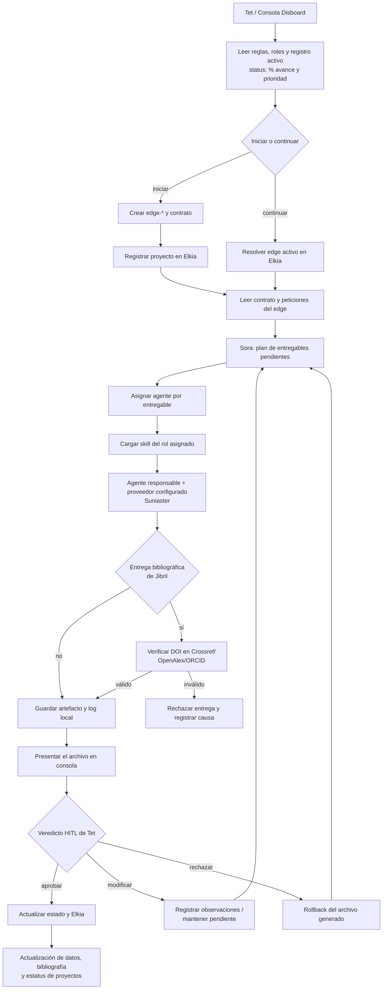
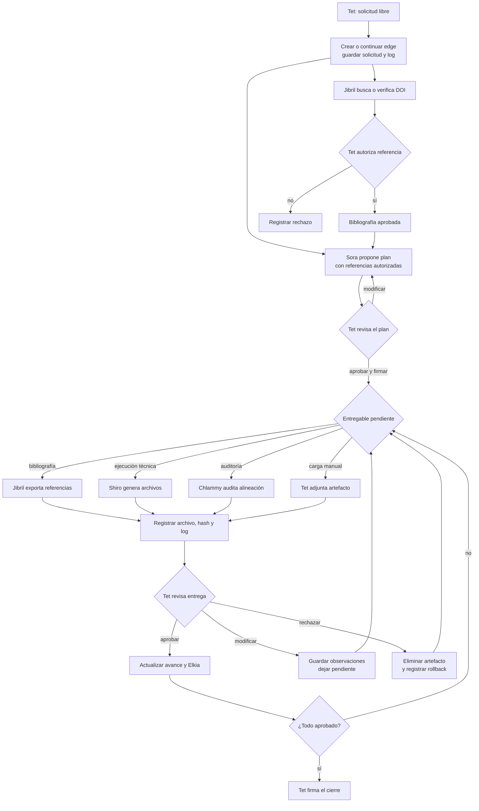
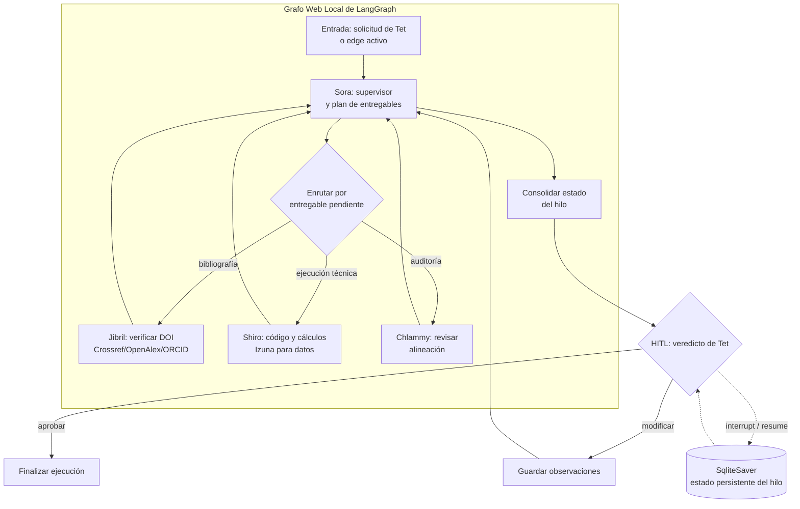

# Disboard-NGNL: Ecosistema Científico Multiagente en Suniaster

Bienvenido a **Disboard-NGNL**, un ecosistema local-first para coordinar proyectos de software, modelado científico y planificación mediante agentes. **Tet** dirige el trabajo y conserva la aprobación humana (**Human-in-the-loop, HITL**). El sistema está diseñado para ejecutarse en un equipo personal que actúa como núcleo, y ser consultado desde otros dispositivos (tablet, laptop secundaria) mediante conexiones seguras y privadas.

Las propiedades de **auditoría, reproducibilidad, compatibilidad multiplataforma, modularidad y protección de datos** son objetivos de arquitectura. Las solicitudes se guardan localmente; las búsquedas bibliográficas envían a Crossref la consulta filtrada y los DOI solicitados. Los logs son auditables desde la aplicación, pero no son inmutables frente a un administrador del host.

> **Nota de nomenclatura:** el contenido de este README está en español. Los nombres de archivos, carpetas y módulos siguen la convención en inglés para homologar con la notación común de repositorios.
>
> **Manual de instalación y uso:** ver [`docs/manual.md`](docs/manual.md) para requisitos del equipo núcleo, requisitos de clientes, instalación, modos de uso (consola, web, Jupyter, Colab, VS Code), acceso remoto seguro y ciberseguridad.

---

## 1. Arquitectura de Agentes y Roles en el Tablero

El repositorio opera bajo un estricto control de **bajo consumo de tokens** para evitar el desperdicio de contexto en las APIs libres.

### 1.1 Plataformas / Núcleo

| Elemento | Definición | Función |
|---|---|---|
| **Elkia** | Plataforma, entorno de trabajo (aplicación web, consola o terminal). | Espacio donde los agentes ejecutan tareas, Shiro corre código, Izuna consulta bases de datos y Stephanie Dola monitorea la estabilidad. |
| **Suniaster** | Núcleo que asigna el modelo de IA a cada agente. | Enrutamiento y actualización de modelos por agente, respetando la política free tier. Si se implementa como agente externo, se registra en `agents/suniaster_updater/`. |

### 1.2 Soberanía del Tablero

- **Tet (Autoridad Soberana):** Defines las reglas, das la idea semilla, apruebas el proyecto de Sora (objetivos, metas y entregables) y validas cada entregable. Puedes sugerir cambios en cualquier punto.

### 1.3 Agentes de Asistencia

- **Stephanie Dola (Diplomática y Orquestadora Principal):** Mantiene el sistema estable y traduce los planes caóticos del día a día. Asistente de Tet en informes, resúmenes y solicitudes de redacción. Evita que los agentes ejecutores colapsen el entorno real y gestiona las restricciones.
  - **Fiel Nirvalen (Subagente de Dola / Asistencia Administrativa):** Apoya en auditorías de logs e informes ejecutivos. Administra la agenda de Tet y redacta borradores de correo seguros, filtrando datos sensibles antes de cualquier prompt externo.

### 1.4 Núcleo de Ejecución Técnico y Científico

- **Sora (El Estratega / Project Manager):** El workflow actual propone una plantilla determinista de objetivos, metas y entregables a partir de la semilla. Tet la puede modificar y firmar; la generación general con LLM no está integrada en este flujo.
  - **Chlammy Zell (Subagente de Sora / Auditora):** Revisa lo que entregan los demás, confronta cada entregable con el plan y reporta a Sora para que valide y presente a Tet.
- **Shiro (El Analista Lógico / Código y Precisión):** El workflow actual produce un scaffold TDD de ejemplo; no ejecuta automáticamente el código ni sus tests, y no llama a Wolfram/LLM desde esta pantalla. Los resultados requieren revisión de Tet.
  - **Izuna (Subagente de Shiro / HPC e Ingeniería de Datos):** Mantiene la base de datos tensorial (ref. arXiv:2211.02753v1), provee recursos a Shiro y valida bases para Jibril.
- **Jibril (Subagente de Sora / Descubrimiento Científico):** Busca sugerencias en Crossref y verifica DOIs consultando Crossref, OpenAlex y ORCID. Tet autoriza cada referencia antes de incorporarla al plan. La búsqueda por tema disponible en el dashboard usa Crossref.

> **Rate limits (Jibril):** Crossref 10 req/s (polite con `mailto`); OpenAlex 10 req/s (sin key) o 30 req/s (con key); ORCID ~8 req/s.

---

### 1.5 Del Concepto a los Entregables

Tet aporta la semilla (pregunta, necesidad, datos, referencias). **Sora** la convierte en objetivos, hitos y criterios comprobables. Los agentes especializados producen evidencia, análisis, software y borradores. **Chlammy** audita la alineación. Las observaciones regresan como trabajo correctivo hasta que **Tet apruebe el cierre**. Si faltan datos, los agentes declaran incertidumbre y piden orientación; no inventan.

La salida depende del edge: informe de avance, aplicación con pruebas o manuscrito para revista. **La aprobación de Tet habilita la entrega dentro del flujo, pero no garantiza decisiones externas de superiores, revisores o revistas.**

---

## 2. Diagrama de Flujo e Interacción del Sistema

El repositorio ofrece dos superficies de trabajo: la **consola de proyectos** y el **dashboard web**. Ambas persisten decisiones y artefactos por edge y requieren el veredicto HITL de Tet antes de cerrar entregables.

### 2.1 Flujo de Consola (HITL con archivos)


```mermaid
flowchart TD
    T["Tet / Consola Disboard"] --> ELKIA["Leer reglas, roles y registro activo<br/>status: % avance y prioridad"]
    ELKIA --> ACTION{"Iniciar o continuar"}
    ACTION -->|iniciar| CREATE_EDGE["Crear edge-* y contrato"]
    CREATE_EDGE --> ELKIA_REGISTER["Registrar proyecto en Elkia"]
    ELKIA_REGISTER --> EDGE_CONTEXT["Leer contrato y peticiones del edge"]
    ACTION -->|continuar| EDGE_LOOKUP["Resolver edge activo en Elkia"]
    EDGE_LOOKUP --> EDGE_CONTEXT
    EDGE_CONTEXT --> S["Sora: plan de entregables pendientes"]
    S --> ASSIGN_AGENT["Asignar agente por entregable"]
    ASSIGN_AGENT --> SK["Cargar skill del rol asignado"]
    SK --> W["Agente responsable + proveedor configurado<br/>Suniaster"]
    W --> J{"Entrega bibliográfica<br/>de Jibril"}
    J -->|sí| JV["Verificar DOI en Crossref/<br/>OpenAlex/ORCID"]
    J -->|no| D["Guardar artefacto y log local"]
    JV -->|válido| D
    JV -->|inválido| X["Rechazar entrega y registrar causa"]
    D --> H["Presentar el archivo en consola"]
    H --> V{"Veredicto HITL de Tet"}
    V -->|aprobar| UPDATE_STATE["Actualizar estado y Elkia"]
    V -->|modificar| P["Registrar observaciones /<br/>mantener pendiente"]
    V -->|rechazar| RB["Rollback del archivo generado"]
    P --> S
    RB --> S
    UPDATE_STATE --> G["Actualización de datos, bibliografía<br/>y estatus de proyectos"]
```

### 2.2 Flujo Web del Dashboard

Tet puede iniciar un edge con una idea libre o enviar una solicitud directa a un edge existente. Sora prepara un plan que Tet puede editar y firmar. Jibril busca en Crossref o verifica un DOI proporcionado por Tet; ninguna referencia pasa al plan hasta que Tet la autoriza. Los entregables pueden ejecutarse con el agente asignado o cargarse desde el equipo. Cada archivo se registra con hash y log; Tet puede aprobarlo, pedir cambios o rechazarlo con rollback. El estado del workflow vive en `workflow.json` y `log.jsonl`; los hilos del grafo LangGraph se guardan por separado en SQLite.


```mermaid
flowchart TD
   T["Tet: solicitud libre"] --> EDGE["Crear o continuar edge<br/>guardar solicitud y log"]
   EDGE --> SORA["Sora propone plan<br/>con referencias autorizadas"]
   SORA --> PLAN{"Tet revisa el plan"}
   PLAN -->|modificar| SORA
   PLAN -->|aprobar y firmar| ROUTE{"Entregable pendiente"}
   EDGE --> JSEARCH["Jibril busca o verifica DOI"]
   JSEARCH --> BIBHITL{"Tet autoriza referencia"}
   BIBHITL -->|sí| BIB["Bibliografía aprobada"]
   BIB --> SORA
   BIBHITL -->|no| LOGREJ["Registrar rechazo"]
   ROUTE -->|bibliografía| JIBRIL["Jibril exporta referencias"]
   ROUTE -->|ejecución técnica| SHIRO["Shiro genera archivos"]
   ROUTE -->|auditoría| CHLAMMY["Chlammy audita alineación"]
   ROUTE -->|carga manual| UPLOAD["Tet adjunta artefacto"]
   JIBRIL --> ARTIFACT["Registrar archivo, hash y log"]
   SHIRO --> ARTIFACT
   CHLAMMY --> ARTIFACT
   UPLOAD --> ARTIFACT
   ARTIFACT --> HITL{"Tet revisa entrega"}
   HITL -->|aprobar| NEXT["Actualizar avance y Elkia"]
   HITL -->|modificar| OBS["Guardar observaciones<br/>dejar pendiente"]
   HITL -->|rechazar| ROLLBACK["Eliminar artefacto<br/>y registrar rollback"]
   OBS --> ROUTE
   ROLLBACK --> ROUTE
   NEXT --> CLOSE{"¿Todo aprobado?"}
   CLOSE -->|no| ROUTE
   CLOSE -->|sí| FINAL["Tet firma el cierre"]
```

> **Trazabilidad:** los cambios del dashboard se guardan en el edge; el checkpointer SQLite conserva adicionalmente los hilos del grafo LangGraph.

**Consola y dashboard son dos interfaces del mismo workflow por edge.** Ambos usan `workflow.json`, `contract.md`, `artifacts/` y `log.jsonl`; puedes aprobar el plan desde una interfaz y continuar los entregables desde la otra. Usa `disboard work <edge_id>` para operar en consola.

### 2.3 Grafo Web Local de LangGraph

El grafo LangGraph es el motor supervisor reanudable (`POST /api/graph/runs` y `POST /api/verdict`) y se mantiene separado del workflow persistente descrito en §2.2. Usa `interrupt()` para pausar en HITL y `SqliteSaver` para guardar el estado del hilo. El workflow del dashboard se consulta mediante `GET /api/runs?project=<edge_id>`.


```mermaid
flowchart TD
   subgraph WEB["Grafo Web Local de LangGraph"]
      IN["Entrada: solicitud de Tet<br/>o edge activo"] --> SUPERVISOR["Sora: supervisor<br/>y plan de entregables"]
      SUPERVISOR --> ROUTE{"Enrutar por<br/>entregable pendiente"}
      ROUTE -->|bibliografía| JIBRIL["Jibril: verificar DOI<br/>Crossref/OpenAlex/ORCID"]
      ROUTE -->|ejecución técnica| SHIRO["Shiro: código y cálculos<br/>Izuna para datos"]
      ROUTE -->|auditoría| CHLAMMY["Chlammy: revisar<br/>alineación"]
      JIBRIL --> SUPERVISOR
      SHIRO --> SUPERVISOR
      CHLAMMY --> SUPERVISOR
      SUPERVISOR --> DRAFT["Consolidar estado<br/>del hilo"]
   end

   DRAFT --> HITL{"HITL: veredicto de Tet"}
   HITL -->|aprobar| RESP["Finalizar ejecución"]
   HITL -->|modificar| OBS["Guardar observaciones"]
   OBS --> SUPERVISOR
   HITL -.->|interrupt / resume| CKPT[("SqliteSaver<br/>estado persistente del hilo")]
   CKPT -.-> HITL
```

---

## 3. Requisitos de Arquitectura

| Propiedad | Implementación esperada |
|---|---|
| **Auditoría** | Logs locales por edge (`edges/<id>/log.jsonl`); registro de cada entrega, agente responsable, timestamp y veredicto HITL. |
| **Reproducibilidad** | Código base de Sora versionado; semillas de cálculo registradas por Shiro; DOI verificados por Jibril con fuente (Crossref/OpenAlex/ORCID). |
| **Compatibilidad multiplataforma** | Elkia operable desde consola (Linux/macOS/Windows) y desde navegador vía servidor web local. |
| **Modularidad** | Cada agente/subagente con skill propia en `skills/`; Suniaster permite intercambiar proveedor de IA por agente sin reescribir el flujo; plantillas de reportería intercambiables en `templates/`. |
| **Protección de datos** | Fiel Nirvalen filtra datos reales antes de prompts externos (`privacy/filters.py`); cálculos sensibles se ejecutan localmente (Shiro/Izuna) cuando sea posible; STT/TTS opcionales con alternativas locales.. |

---

## 4. Tablero Web Local y Privacidad

### Indicaciones elementales de uso

1. **Requisitos previos:** Python 3.11+ y las dependencias del repositorio (`pip install -e ".[dev]"`). El backend se ejecuta en el equipo núcleo.
2. **Arranque del servidor local:** `make web` o `uvicorn web.server:app --host 127.0.0.1 --port 8000`. Por defecto escucha en localhost.
3. **Acceso desde el navegador:** abrir `http://localhost:8000` desde el navegador del equipo núcleo o de un cliente autorizado. No se requiere instalar nada en el cliente.
4. **Flujo de trabajo:** envía una solicitud libre desde el inicio, revisa el plan de Sora, autoriza referencias de Jibril, ejecuta o adjunta entregables y decide cada veredicto HITL.
5. **Persistencia:** solicitudes, workflow, contrato, artefactos y bitácora quedan en el edge local; cada aprobación requiere `TET_SIGNING_KEY`.

## 4.2 Dashboard

El servidor web también expone un dashboard en la raíz (`/`) que actúa como centro de operaciones de Tet. El dashboard se implementa en `web/dashboard/views.py` y `web/templates/` (plantillas Jinja2). Muestra:

- **Solicitud directa**: crea un edge desde texto libre o continúa un edge existente.
- **Plan HITL**: revisa, modifica y firma objetivos, metas y asignación de agentes.
- **Bibliografía**: búsqueda en Crossref o verificación DOI en Crossref/OpenAlex/ORCID; Tet autoriza cada referencia antes de usarla.
- **Entregables**: ejecutar Jibril/Shiro/Chlammy o adjuntar un archivo; Tet aprueba, solicita cambios o rechaza con rollback.
- **Trazabilidad**: avance, prioridad, contrato, aprobaciones firmadas, SHA-256 y bitácora por edge.
- **Agenda**: planes, referencias y entregables que esperan decisión de Tet.

**Límites actuales:** el scaffold de Sora/Shiro es determinista, la auditoría de Chlammy es básica y el dashboard no ejecuta código de Shiro. La firma HMAC protege veredictos de Tet; no cifra los datos en disco ni vuelve los logs inmutables frente al administrador del equipo.

### Endpoints principales del dashboard

| Método | Ruta | Descripción |
|--------|------|-------------|
| GET | `/` | Dashboard principal (HTML) |
| GET | `/edges` | Lista de edges con avance y prioridad |
| GET | `/edges/{id}` | Detalle del edge |
| GET | `/edges/new` | Formulario para crear edge |
| POST | `/edges/new` | Crear edge |
| GET | `/agenda` | Agenda y pendientes |
| GET | `/artifacts/{edge_id}/{name}` | Servir artefacto (con validación de hash) |
| POST | `/api/requests` | Solicitud directa nueva o sobre edge existente |
| GET/POST | `/api/edges/{id}/workflow`, `/plan`, `/bibliography/*`, `/deliverables/*`, `/final/decision` | Operación HITL del edge |
| POST | `/api/graph/runs`, `/api/verdict` | Iniciar y reanudar el grafo LangGraph auxiliar |
| GET | `/api/status`, `/api/projects`, `/api/artifacts`, `/api/bibliography`, `/api/runs`, `/api/models` | Consulta JSON |

### Privacidad

- **Datos en consultas externas:** la búsqueda libre del dashboard aplica `privacy.filters` antes de consultar Crossref. Las solicitudes permanecen en el edge local; revisa la política antes de habilitar otras integraciones.
- **Almacenamiento local:** logs, bases de datos tensoriales (Izuna) y artefactos generados residen en el equipo núcleo. No se envían a servicios externos salvo consultas estrictamente necesarias (DOIs, cálculos simbólicos, inferencia de IA).
- **Checkpointer:** el grafo web conserva sus hilos en SQLite (`logs/web_graph_checkpoints.sqlite`) mediante el saver oficial de LangGraph. El workflow del dashboard se persiste en `edges/<id>/workflow.json` y su auditoría en `log.jsonl`.
- **Documentación de privacidad:** `docs/privacy.md` describe la postura arquitectónica; `privacy/prompts_policy.md` contiene la política operativa que aplica Fiel Nirvalen.
- **Acceso remoto:** para consultar desde tablet u otro equipo fuera de la red local, ver `docs/manual.md` (Cloudflare Tunnel con `homehost` o SSH al Codespace). Nunca exponer el servidor sin TLS ni autenticación.

---

## 5. Agentes en el Tablero

### 5.1 Agentes

| Agente | Tipo | Rol sintético |
|---|---|---|
| **Sora** | Principal | Estratega y Project Manager; propone plan y dirige tareas. |
| **Chlammy Zell** | Subagente de Sora | Auditora; confronta entregables vs. plan y reporta a Sora. |
| **Shiro** | Principal | Analista lógico; código, cálculos y entregables técnicos. |
| **Izuna** | Subagente de Shiro | Bases de datos tensoriales; provee recursos a Shiro. |
| **Stephanie Dola** | Principal | Orquestadora diplomática; estabilidad, restricciones y asistencia a Tet. |
| **Fiel Nirvalen** | Subagente de Dola | Asistencia administrativa; agenda, correos seguros e informes. |
| **Jibril** | Subagente de Sora | Descubrimiento científico; bibliografía y metadatos con DOI verificado. |

### 5.2 Plataformas

| Plataforma | Rol |
|---|---|
| Elkia | Entorno de trabajo (consola, web, base de datos). |
| Suniaster | Enrutador de modelos de IA por agente; actualizador de proveedores. Si se implementa como agente externo, se registra en `agents/suniaster_updater/`. |

> **Nota:** Elkia y Suniaster no aparecen en la tabla de agentes porque son plataformas, no agentes. Su rol se describe en §1.1.

### 5.3 Manejo de la falta de claves (Wolfram, API keys)
Si falta una clave externa (por ejemplo, `WOLFRAM_API_KEY`), Suniaster **no deja a Shiro sin recurso**: le asigna un proveedor alternativo capaz de cálculo simbólico o simulación de código Wolfram. Shiro declara explícitamente qué proveedor usó y con qué limitaciones, y **Tet valida el resultado** antes de integrarlo. Si ningún proveedor alternativo está disponible, Shiro declara incertidumbre y no inventa.

---

## 6. Estructura del Repositorio

```text
Disboard-NGNL/
├── README.md
├── LICENSE
├── .gitignore
├── .editorconfig
├── .pre-commit-config.yaml
├── .env.example
├── pyproject.toml
├── requirements.txt
├── Makefile
├── docker-compose.yml
│
├── .devcontainer/
│   ├── Dockerfile
│   └── devcontainer.json
│
├── .github/
│   └── workflows/
│       └── ci.yml
│
├── config/
│   ├── apis.yaml
│   └── logging.yaml
│
├── core/
│   ├── __init__.py
│   ├── edge.py
│   ├── contract.py
│   ├── log.py
│   ├── artifact.py
│   ├── hitl.py
│   ├── state_schema.py
│   ├── checkpointer.py
│   └── plugins.py
│
├── elkia/
│   ├── __init__.py
│   ├── registry.py
│   ├── rules.py
│   ├── state.py
│   ├── dashboard.py
│   └── cli.py

├── suniaster/
│   ├── __init__.py
│   ├── config.yaml
│   ├── providers.py
│   ├── router.py
│   └── updater.py
│
├── agents/
│   ├── __init__.py
│   ├── base.py
│   ├── sora/
│   │   ├── agent.py
│   │   └── tracking_template.py
│   ├── chlammy/
│   │   └── agent.py
│   ├── shiro/
│   │   ├── agent.py
│   │   ├── antigravity_client.py
│   │   └── wolfram_client.py
│   ├── izuna/
│   │   ├── agent.py
│   │   ├── tensor_db.py
│   │   ├── tensor_schema.py
│   │   ├── duckdb_engine.py
│   │   ├── authorities.py
│   │   └── pipeline.py
│   ├── dola/
│   │   └── agent.py
│   ├── fiel_nirvalen/
│   │   ├── agent.py
│   │   └── privacy_filter.py
│   ├── jibril/
│   │   ├── agent.py
│   │   ├── crossref_client.py
│   │   ├── openalex_client.py
│   │   ├── orcid_client.py
│   │   └── doi_verifier.py
│   └── suniaster_updater/
│       └── agent.py
│
├── skills/
│   ├── README.md
│   ├── sora-planning/SKILL.md
│   ├── shiro-execution/SKILL.md
│   ├── stephanie-review/SKILL.md
│   ├── fiel-assistance/SKILL.md
│   ├── izuna-data-engineering/SKILL.md
│   ├── jibril-bibliography/SKILL.md
│   ├── chlammy-alignment/SKILL.md
│   └── methodologies/
│       ├── spec-driven-development.md
│       ├── test-driven-development.md
│       └── doubt-driven-development.md
│
├── console/
│   ├── __init__.py
│   ├── main.py
│   ├── commands.py
│   └── presentation.py
│
├── web/
│   ├── __init__.py
│   ├── server.py
│   ├── security.py
│   ├── workflow.py
│   ├── graph.py
│   ├── checkpointer.py
│   ├── nodes/
│   │   ├── __init__.py
│   │   ├── supervisor.py
│   │   ├── jibril_node.py
│   │   ├── shiro_node.py
│   │   ├── chlammy_node.py
│   │   └── hitl_node.py
│   ├── dashboard/
│   │   ├── __init__.py
│   │   └── views.py
│   └── templates/
│       ├── base.html
│       ├── index.html
│       └── edge_detail.html
│
├── privacy/
│   ├── __init__.py
│   ├── filters.py
│   └── prompts_policy.md
│
├── tools/
│   ├── __init__.py
│   ├── audit.py
│   ├── data_loader.py
│   ├── data_folder.py
│   ├── data_catalog.py
│   ├── document_generator.py
│   ├── environment.py
│   ├── pdf_extractor.py
│   ├── reporter.py
│   ├── speech_input.py
│   ├── speech_output.py
│   └── test_runner.py
│
├── templates/
│   ├── preprint.tex.j2
│   ├── report.md.j2
│   └── slides.md.j2
│
├── disboard_ext/
│   ├── __init__.py
│   └── local_artifact_store.py
│
├── scripts/
│   ├── init_edge.py
│   ├── verify_dois.py
│   └── healthcheck.py
│
├── examples/
│   ├── edge-example/
│   │   ├── contract.md
│   │   ├── README.md
│   │   └── seed.md
│   └── notebook_demo.ipynb
│
├── docs/
│   ├── manual.md
│   ├── architecture.md
│   ├── agent_roles.md
│   ├── github-deployment.md
│   ├── web-local.md
│   ├── privacy.md
│   ├── sovereign-oath.md
│   ├── report-manifest-template.md
│   └── adr/
│       ├── 0001-langgraph-usage.md
│       ├── 0002-suniaster-as-router.md
│       └── 0003-antigravity-for-shiro.md
│
├── edges/
│   └── .gitkeep
│
├── logs/
│   └── .gitkeep
│
└── tests/
    ├── __init__.py
    ├── conftest.py
    ├── browser_smoke.py
    ├── render_mermaid.py
    ├── test_console.py
    ├── test_core.py
    ├── test_data.py
    ├── test_elkia.py
    ├── test_plugins.py
    ├── test_suniaster.py
    ├── test_web_graph.py
   ├── test_web_security.py
   ├── test_web_workflow.py
    └── test_agents/
        ├── __init__.py
        ├── test_sora.py
        ├── test_chlammy.py
        ├── test_shiro.py
        ├── test_izuna.py
        ├── test_dola.py
        ├── test_fiel_nirvalen.py
        └── test_jibril.py
```

---

## 7. El Juramento Soberano (Las Diez Reglas)

> *«...Las Diez Reglas rigen este mundo. Todos los conflictos, desde disputas territoriales hasta ecuaciones cuánticas, se resolverán a través de juegos. Declara tu jugada, mide tus cómputos y que comience la partida...»*

1. No habrá daño físico, guerra ni saqueo en el Disboard.
   > *↳ En el tablero: ningún agente destructivo, ningún borrado sin rollback. Toda acción sobre archivos o bases pasa por HITL y por la bitácora.*

2. Todos los conflictos se resolverán mediante victoria o derrota en juegos.
   > *↳ En el tablero: toda decisión se resuelve en el grafo (consola o web), no por fuera del flujo. Si hay desacuerdo entre agentes, Chlammy arbitra y Tet decide.*

3. Los juegos se jugarán por apuestas que ambas partes consideren de igual valor.
   > *↳ En el tablero: cada entregable se negocia en el contrato de Sora; objetivos, metas y criterios de aceptación deben ser explícitos y aprobados por Tet.*

4. Cualquier juego o apuesta está permitido, siempre que no contradiga la Regla 3.
   > *↳ En el tablero: cualquier metodología o plantilla es válida (TDD, SDD, DDD, preprints, informes, slides) siempre que respete el contrato y los requisitos de arquitectura.*

5. La parte desafiada tiene derecho a determinar el juego.
   > *↳ En el tablero: el agente responsable del entregable elige su skill y su proveedor (vía Suniaster); Chlammy solo audita, no impone el método.*

6. Las apuestas juradas por los Convenios son absolutas.
   > *↳ En el tablero: una vez que Tet firma con HMAC, el contrato y los entregables aprobados son vinculantes; cambiarlos requiere nueva firma.*

7. Para conflictos entre grupos, se establecerá un agente plenipotenciario.
   > *↳ En el tablero: Stephanie Dola actúa como orquestadora plenipotenciaria entre agentes; Fiel Nirvalen como asistente administrativa de Tet.*

8. Si se descubre trampa en un juego, se contará como derrota.
   > *↳ En el tablero: si Chlammy detecta que un entregable no cumple el contrato, se rechaza, se registra la causa en la bitácora y se ejecuta rollback.*

9. Las reglas anteriores son absolutas e inmutables, en nombre del Soberano (Tet).
   > *↳ En el tablero: Tet conserva la aprobación final; ningún agente puede saltarse el HITL ni modificar el contrato sin su firma.*

10. **¡Divertámonos todos juntos! (Aschente!)**
    > *↳ En el tablero: el objetivo es que el flujo sea disfrutable y reproducible; si algo deja de serlo, se replantea en el próximo edge.*

> **Nota:** este Juramento, con sus analogías operativas, se replica en `docs/sovereign-oath.md` para referencia rápida.

✦ **¡Aschente!** ✦
